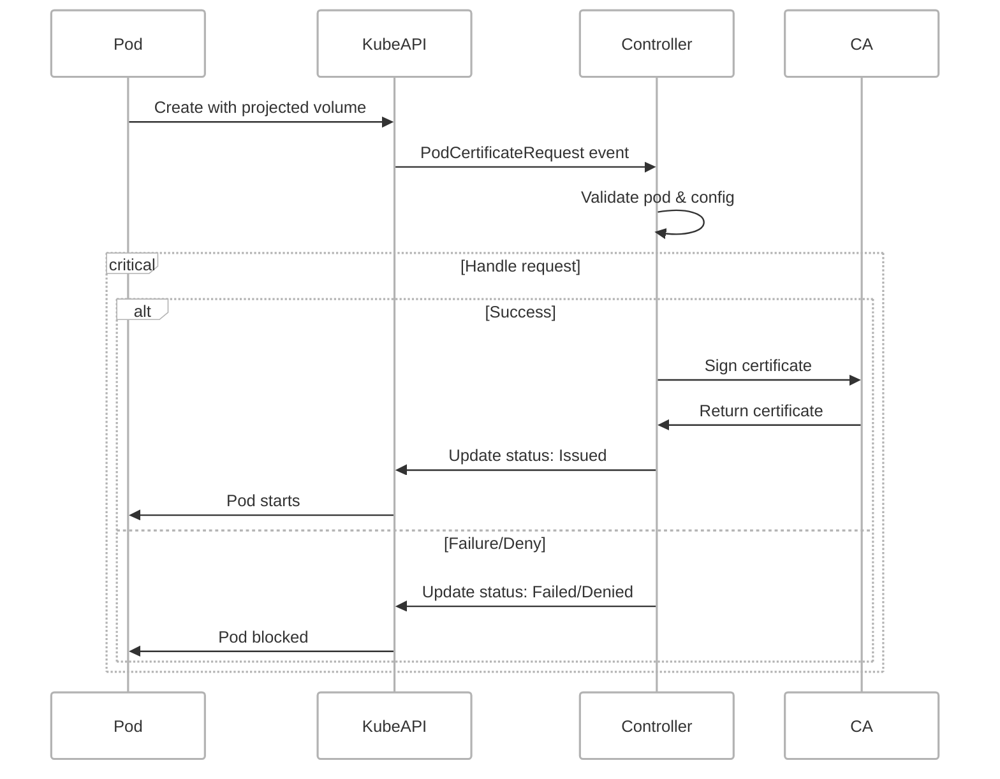

🔐 **PodCertificateSigner**: A Kubernetes controller that issues x509 certificates from a custom provided CA for your pods.

> This controller is not yet ready to deploy to PRODUCTION facing worklads - it is being actively developed and should be considered for TESTING and validating concepts now

- [pod-certificate-signer (PCS): Custom signer for x509 pod certificates](#pod-certificate-signer-pcs-custom-signer-for-x509-pod-certificates)
  - [📋 Overview](#-overview)
    - [What PodCertificateSigner Does](#what-podcertificatesigner-does)
    - [Why Do You Need PodCertificateSigner](#why-do-you-need-podcertificatesigner)
    - [Key Benefits](#key-benefits)
  - [Features](#features)
  - [🔄 How It Works](#-how-it-works)
  - [📋 Prerequisites](#-prerequisites)
  - [🚀 Kubernetes Deployment](#-kubernetes-deployment)
  - [📦 Helm Deployment](#-helm-deployment)
  - [🛠️ Manual Deployment](#️-manual-deployment)
    - [1. 🔐 Create CA and Secret](#1--create-ca-and-secret)
    - [2. ⚙️ Create ServiceAccount and RBAC](#2-️-create-serviceaccount-and-rbac)
    - [3. 🚀 PodCertificateSigner Deployment](#3--podcertificatesigner-deployment)
  - [📝 Usage](#-usage)
    - [🏷️ Configuration via Pod Annotations](#️-configuration-via-pod-annotations)
      - [🔗 Example configuration](#-example-configuration)
    - [Requesting PodCertificates for your workload](#requesting-podcertificates-for-your-workload)
      - [🔗 Example workload manifest](#-example-workload-manifest)
  - [✅ Default PodCertificateSigner validation rules](#-default-podcertificatesigner-validation-rules)
  - [⌘ Controller commandline options](#-controller-commandline-options)
  - [🔧 Troubleshooting](#-troubleshooting)
    - [Common Issues](#common-issues)
    - [📊 Logs](#-logs)
  - [🛡️ Security Considerations](#️-security-considerations)
  - [🤝 Contributing](#-contributing)
    - [Unofficial roadmap/work in progress](#unofficial-roadmapwork-in-progress)
# pod-certificate-signer (PCS): Custom signer for x509 pod certificates

## 📋 Overview

PodCertificateSigner is a simple controller operating on **native feature** introduced in Kubernetes v1.34+ that creates [PodCertificateRequest](https://kubernetes.io/docs/reference/access-authn-authz/certificate-signing-requests/#pod-certificate-requests) for your pods that specify a custom x509 signer via projected volume.From your custom configuration the contoller issues(or denies) short lived x509 certificates making sure your workloads can leverage this in their operations ( either for mTLS or just TLS )

Further to that enhancments combining with [Cluster Trust Bundles](https://kubernetes.io/docs/reference/access-authn-authz/certificate-signing-requests/#cluster-trust-bundles) / MutatingAdmissionPolicies / ValidatingAdmissionPolicy will provide the cluster operator with extremly strong security framework of operations to secure your cluster and its workloads.


### What PodCertificateSigner Does
- **Handle PodCertificateRequest**: responds and validates all requests for new pod certificates
- **Validates new x509 certificate configuration**: making sure the dynamic configuration is correct
- **Signs pod x509 certificates** or deny issuing a cetrtificate based on the configuration and cluster information.

###  Why Do You Need PodCertificateSigner
- **Secures your workloads east/west traffic** by issuing shortlived x509 certificates to your pods
- **Declarative security** by providing the configuration to your workloads
- **Enabling mTLS** by allowing you to implement strict client/server auth from the x509 certs
- **Enhancing your cluster security** without any external tools - you can use native cluster features to stregthen your security. 

### Key Benefits
- **Zero false positives** - only kube-api creates the PodCertificateRequests
- **Easy integration** - works with existing Kubernetes clusters
- **Comprehensive logging** - full audit trail of decisions
- **Flexible configuration** - supports dynamic configuration via annotations

## Features

- **Support for TLS/mTLS certificates**: You can decide how to use the certificates
- **Annotation-Based**: Uses pod annotations to specify certificate configurations


## 🔄 How It Works

1. **Pod Creation**: When a pod is created in Kubernetes with the projected volume , the kube-api server creates `PodCertificateRequest`
2. **Annotation Check**: PodCertificateSigner looks for predefined configuration annotations to customize the certificate
3. **Validation**: It validates the certificate configuration against default checks
4. **Decision**: The certificate for pod is either issued or denied based on validation results. 




## 📋 Prerequisites
> To test this setup with kind you can use prepared [kind-config](https://github.com/RafPe/pod-certificate-signer/blob/main/kind/kind-config.yaml) 

- Kubernetes cluster version 1.34+ ( requires feature gates ) 
- CA certificate ( can be self-signed )


## 🚀 Kubernetes Deployment
A ready to use manifest file is available under `manifests` folder

## 📦 Helm Deployment

> ... coming soon

## 🛠️ Manual Deployment

Manual deployment is also an option too, please ensure you follow the manifest guide below to correctly configure the controller.

### 1. 🔐 Create CA and Secret

You will need to create a valid CA which will be used by the controller to sign the pod certificate requests. There are many ways of approaching this either via tool like the [cfssl](https://github.com/cloudflare/cfssl) or leverage [`cert-manager`](https://cert-manager.io/) or if you live in terminal you can use `openssl` cli. 

Of course if you have an existing CA you would like to use simply skip the creation and use that as the source for secret

>Adapt the resulting name and namespace as needed 
After you generated the certificate create a secret out it of type `TLS`
```sh
kubectl create secret tls ca-secret \
  --cert=ca.pem \
  --key=ca-key.pem
```


```yaml
apiVersion: v1
kind: Secret
metadata:
  name: pcs-ca
  namespace: system
type: kubernetes.io/tls
data:
  tls.crt: <base64-encoded-certificate>
  tls.key: <base64-encoded-private-key>
```

### 2. ⚙️ Create ServiceAccount and RBAC

Next we will create a dedicated ServiceAccount and associated RBAC permissions for our controller.


```yaml
---
apiVersion: v1
kind: ServiceAccount
metadata:
  name: pcs
  namespace: system
```

```yaml
---
apiVersion: rbac.authorization.k8s.io/v1
kind: ClusterRole
metadata:
  name: pcs-controller-role
rules:
# Events
- apiGroups:
  - ""
  resources:
  - events
  verbs:
  - create
  - patch

# Pods - need get for reading, patch/update for annotations
- apiGroups:
  - ""
  resources:
  - pods
  verbs:
  - get
  - patch
  - update
  - list      # REQUIRED for watching
  - watch     # REQUIRED for watching  

# PodCertificateRequests - monitor only
- apiGroups:
  - certificates.k8s.io
  resources:
  - podcertificaterequests
  verbs:
  - get
  - list
  - watch

# Status subresource - required for issuing certificates
- apiGroups:
  - certificates.k8s.io
  resources:
  - podcertificaterequests/status
  verbs:
  - update

# Finalizers
- apiGroups:
  - certificates.k8s.io
  resources:
  - podcertificaterequests/finalizers
  verbs:
  - update

# Signer permission - required
- apiGroups:
  - certificates.k8s.io
  resources:
  - signers
  resourceNames:
  - "coolcert.example.com/foo"
  verbs:
  - sign

---
apiVersion: rbac.authorization.k8s.io/v1
kind: ClusterRoleBinding
metadata:
  name: meshtool-is-a-meshtool-signer
roleRef:
  apiGroup: rbac.authorization.k8s.io
  kind: ClusterRole
  name: pcs-controller-role
subjects:
- kind: ServiceAccount
  namespace: system
  name: pcs

```

### 3. 🚀 PodCertificateSigner Deployment

Deployment manifest is on purpose kept simple - you are free to expand it as needed. 

> Change the image for the controller 

> Change the signer name

```yaml
---
apiVersion: apps/v1
kind: Deployment
metadata:
  name: pcs-controller
  namespace: system
  labels:
    app: pcs-controller
spec:
  replicas: 1 # we need leader election to properly work with multiple replicas
  selector:
    matchLabels:
      app: pcs-controller
  template:
    metadata:
      labels:
        app: pcs-controller
    spec:
      securityContext:
        # Projects are configured by default to adhere to the "restricted" Pod Security Standards.
        # This ensures that deployments meet the highest security requirements for Kubernetes.
        # For more details, see: https://kubernetes.io/docs/concepts/security/pod-security-standards/#restricted
        runAsNonRoot: true
        seccompProfile:
          type: RuntimeDefault
      containers:
      - command:
        - /manager
        args:
          - --signer-name=coolcert.example.com/foo 👈 update signer name here!
          - --ca-cert-path=/etc/ssl/ca/ca.pem
          - --ca-key-path=/etc/ssl/ca/ca-key.pem         
        image: ghcr.io/rafpe/kubernetes-podcertificate-signer/controller:latest 👈 update image here!
        imagePullPolicy: Always		
        name: manager
        ports: []
        resources:
          limits:
            cpu: 125m          
            memory: 256Mi
          requests:
            cpu: 10m
            memory: 32Mi        
        securityContext:
          readOnlyRootFilesystem: true
          allowPrivilegeEscalation: false
          capabilities:
            drop:
            - "ALL"
        volumeMounts:
        - name: ca-secret
          mountPath: /etc/ssl/ca
          readOnly: true              
      volumes:
      - name: ca-secret
        secret:
            secretName: ca-secret
            items:
            - key: tls.crt
              path: ca.pem
            - key: tls.key
              path: ca-key.pem          
      dnsPolicy: Default
      nodeSelector:
        kubernetes.io/os: linux
      priorityClassName: system-cluster-critical
      restartPolicy: Always
      schedulerName: default-scheduler
      serviceAccountName: pcs
      terminationGracePeriodSeconds: 10
```


## 📝 Usage

### 🏷️ Configuration via Pod Annotations
In order to not use controller defaults for certificates being generated - the cluster operator is able to set customize that via [`annotations`](https://kubernetes.io/docs/concepts/overview/working-with-objects/annotations/). 

The scheme for configuration is `signer-domain/name-<configuration-item>: <value>`

Below is the table with the annotations and example values: 

| Annotation Prefix        | Required | Default Value                                                                       | Example                                                                                              |
| ------------------------ | -------- | ----------------------------------------------------------------------------------- | ---------------------------------------------------------------------------------------------------- |
| `{signer-name}-cn`       | No       | `{pod-name}`                                                                        | `mysigner.example.com/foobar-cn: my-pod.default.pod.cluster.local`                                   |
| `{signer-name}-san`      | No       | `{pod-name}.{namespace}.pod.cluster.local,{pod-name}.{namespace}.svc.cluster.local` | `mysigner.example.com/foobar-san: my-pod.default.pod.cluster.local,my-pod.default.svc.cluster.local` |
| `{signer-name}-uris`     | No       | `(empty)`                                                                           | `mysigner.example.com/foobar-uris: spiffe://cluster.local/ns/default/sa/my-service`                  |
| `{signer-name}-duration` | No       | `24h`                                                                               | `mysigner.example.com/foobar-duration: 12h`                                                          |
| `{signer-name}-refresh`  | No       | `1h`                                                                                | `mysigner.example.com/foobar-refresh: 30m`                                                           |


To customize certificates issued by PodCertificateSigner you can add one of the following annotations to your pod. This operation can be automated and delegated to your pipeline(s) or you can leverage native Kubernetes enhancment i.e `MutatingAdmissionPolicy` 


#### 🔗 Example configuration
```yaml
  # ..... content not relevant for the example

  template:
    metadata:
      labels:
        app: podcertificate-app
      annotations:
        coolcert.example.com/foo-cn: "some-epic-name.com"
        coolcert.example.com/foo-san: "example.com, www.example.com, anotherexample.com.cy"
        coolcert.example.com/foo-duration: "2h"
        coolcert.example.com/foo-refresh: "30m" 
        coolcert.example.com/foo-uris: "https://example.com, https://www.example.com, https://anotherexample.com.cy"                
    spec:

  # ..... rest of the manifest
```


### Requesting PodCertificates for your workload
In order for kube-api server to create new PodCertificateRequests your workload needs to use specified projected volume referencing a signer. 
Snipper below shows the crucial part of your code configuration required 
```yaml
  # ..... content not relevant for the example

        volumeMounts:
        - name: x509-cert
          mountPath: /var/run/x509-cert
      volumes:
      - name: x509-cert
        projected:
          defaultMode: 420
          sources:
          - podCertificate:
              keyType: RSA4096 # "RSA3072", "RSA4096", "ECDSAP256", "ECDSAP384", "ECDSAP521", "ED25519"
              signerName: coolcert.example.com/foo # 👈 IMPORTANT! The signer name must match controller
              credentialBundlePath: credentialbundle.pem

  # ..... rest of the manifest              
```

#### 🔗 Example workload manifest
The below provided deployment manifest is using GowebHTTPs server I wrote in Go in order to explore use of certificates in container environment. 


```yaml
---
apiVersion: apps/v1
kind: Deployment
metadata:
  name: goweb
  labels:
    app: goweb-https
spec:
  replicas: 1
  selector:
    matchLabels:
      app: goweb-https
  template:
    metadata:
      labels:
        app: goweb-https
      annotations:
        coolcert.example.com/foo-cn: "some-epic-name.com"
        coolcert.example.com/foo-san: "example.com, www.example.com, anotherexample.com.cy"
        coolcert.example.com/foo-duration: "1h"
        coolcert.example.com/foo-refresh: "45m"        
    spec:
      containers:
      - name: server
        image: ghcr.io/rafpe/goweb-https/server:d567d45        
        ports:
        - containerPort: 8443
          name: https
          protocol: TCP
        env:
        - name: GOWEB_PORT
          value: "8443"
        - name: GOWEB_CERT_DIRECTORY_PATH
          value: "/var/run/pcr-x509"
        - name: TZ
          value: "Europe/Amsterdam" # 👈 Update to match your timezone
        - name: POD_NAME
          valueFrom:
            fieldRef:
              fieldPath: metadata.name
        - name: POD_NAMESPACE
          valueFrom:
            fieldRef:
              fieldPath: metadata.namespace
        - name: NODE_NAME
          valueFrom:
            fieldRef:
              fieldPath: spec.nodeName
        - name: CONTAINER_NAME
          value: "server"
        volumeMounts:
        - name: pcr-x509
          mountPath: /var/run/pcr-x509
          readOnly: true
        resources:
          requests:
            memory: "64Mi"
            cpu: "50m"
          limits:
            memory: "128Mi"
            cpu: "100m"
        securityContext:
          allowPrivilegeEscalation: false
          runAsNonRoot: true
          runAsUser: 65532
          runAsGroup: 65532
          readOnlyRootFilesystem: true
          capabilities:
            drop:
            - ALL
      volumes:
      - name: pcr-x509
        projected:
          defaultMode: 420
          sources:
          - podCertificate:
              keyType: RSA4096
              signerName: coolcert.example.com/foo
              credentialBundlePath: credentialbundle.pem
      securityContext:
        fsGroup: 65532
      restartPolicy: Always
      terminationGracePeriodSeconds: 5
```


As a bonus point if using this workload demo you can check the certificate status via call to `/status` which provides detailed view of mounted certificate.
```sh
📜 Certificate Status:

Domain: some-epic-name.com
  File: /var/run/pcr-x509/credentialbundle.pem
  CN: some-epic-name.com
  Valid: 2025-09-24 11:33:54 UTC to 2025-09-24 12:33:54 UTC
  Status: ⚠️  EXPIRES SOON (in 57m46s)
```


## ✅ Default PodCertificateSigner validation rules

PodCertificateSigner performs the following `default` validations:

1. **CA files provided**: Verifies the CA provided/mounted files exists and can be loaded
2. **CA valid**: Ensures that the CA used to signing of certificates is a valid CA and not expired
3. **PodCertificateRequest configuration**: Validates the configuration provided via annotation against Kubernetes constraints

## ⌘ Controller commandline options
Controller is customizable and supports the following arguments along with their default values 
```
command line argument:
  -ca-cert-path string
    	CA certificate file. (default "/Users/rafalpieniazek/github.com/rafpe/kubernetes-podcertificate-signer/hack/ca.pem")
  -ca-key-path string
    	CA private key file. (default "/Users/rafalpieniazek/github.com/rafpe/kubernetes-podcertificate-signer/hack/ca-key.pem")
  -cluster-fqdn string
    	The FQDN of the cluster (default "cluster.local")
  -debug-logging
    	Enable debug logging.
  -enable-leader-election
    	Enable leader election for controller manager. Enabling this will ensure there is only one active controller manager.
  -health-probe-bind-address string
    	The address the probe endpoint binds to. (default ":8081")
  -kubeconfig string
    	Paths to a kubeconfig. Only required if out-of-cluster.
  -leader-elect
    	Enable leader election for controller manager. Enabling this will ensure there is only one active controller manager.
  -leader-election-id string
    	The name of the configmap used to coordinate leader election between controller-managers. (default "pcs-leader-election")
  -signer-name string
    	Only sign CSR with this .spec.signerName. (default "coolcert.example.com/foo")
  -zap-devel
    	Development Mode defaults(encoder=consoleEncoder,logLevel=Debug,stackTraceLevel=Warn). Production Mode defaults(encoder=jsonEncoder,logLevel=Info,stackTraceLevel=Error) (default true)
  -zap-encoder value
    	Zap log encoding (one of 'json' or 'console')
  -zap-log-level value
    	Zap Level to configure the verbosity of logging. Can be one of 'debug', 'info', 'error', 'panic'or any integer value > 0 which corresponds to custom debug levels of increasing verbosity
  -zap-stacktrace-level value
    	Zap Level at and above which stacktraces are captured (one of 'info', 'error', 'panic').
  -zap-time-encoding value
    	Zap time encoding (one of 'epoch', 'millis', 'nano', 'iso8601', 'rfc3339' or 'rfc3339nano'). Defaults to 'epoch'.
```

## 🔧 Troubleshooting
Every system can experience issues. Below you may find the most commonly identified ones.

### Common Issues

1. **Signer name mismatch**
   - Ensure signer name is correct in the controller
   - Ensure signer name is correct in the projected volume of the pod(s)

2. **CA failures**
   - Verify CA is valid ( isCA )
   - Verify private key is valid
   - Ensure the CA is not expiring too soon

3. **Configuration Errors**
   - Verify if your configuration on annotation is not causing errors
   - Troubleshoot by incremently changing the configuration to eliminate the source
   - Keep checking the PodCertificateSigner logs

### 📊 Logs

PodCertificateSigner provides detailed logging for troubleshooting:

```bash
kubectl logs -n system deployment/pcs-controller
```

## 🛡️ Security Considerations

- Use Kubernetes secrets to store certificates/keys
- Monitor controller logs for suspicious activity
- Use RBAC or ValidatingAdmissionPolicy to restrict access
- Bonus: Use MutatingAdmissionPolicies to implement secure usage of the annotation

🔐 Remember: No security mechanism is effective without strong authentication and authorization. In Kubernetes, security begins with controlling who can access what — user identities , RBAC policies and MutatingAdmissionPolicies/ValidatingAdmissionPolicy to form the foundation of your cluster's defense.

## 🤝 Contributing

Contributions are welcome! 

For issues and questions:
- 📝 Create an issue in the repository
- 🔍 Check the troubleshooting section
- 📊 Review the logs for error details

### Unofficial roadmap/work in progress
There is work planned in the controller that still needs to happen however this is heavily influenced by the development of this feature in Kubernetes community  
- [ ] code::proper validation of certificate constraints ( time based nbf,naf , refresh hint)
- [ ] code::object consistency Camel/Snake casing
- [ ] code::improve debug/standard logging across components
- [ ] feature::implement leader election?
- [ ] feature::metrics/webhooks ?
- [ ] feature::cleanup issued certificates for missing pods ( Karpenter scenarios )
- [ ] feature::generate Cluster Trust Bundles on start ?
- [ ] feature::check pod subdomain/host as fqdn options
- [ ] feature::customizable KeyUsage via policies ? CEL ? Like client auth only or just TLS
- [ ] feature::podidentity ?
- [ ] feature::OIDC ?
- [ ] testing::implement core tests
- [ ] testing::implement e2e testing
- [ ] testing::examples of apps using TLS 
- [ ] testing::examples of controller deployment


