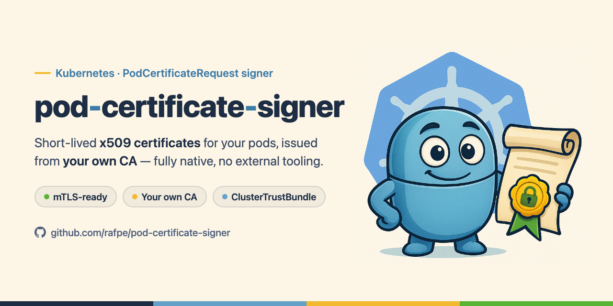

<p align="center">
  
</p>

[](https://github.com/RafPe/pod-certificate-signer/actions/workflows/test.yml)
[](https://github.com/RafPe/pod-certificate-signer/actions/workflows/lint.yml)
[](./LICENSE)
[](https://github.com/rafpe/pod-certificate-signer/releases)
[](./go.mod)
[](https://artifacthub.io/packages/search?repo=podcertificate-signer)
[](https://scorecard.dev/viewer/?uri=github.com/RafPe/pod-certificate-signer)

# pod-certificate-signer

A Kubernetes controller that signs the native `PodCertificateRequest` API, issuing short-lived x509 certificates to your pods from your own CA and publishing that CA as a `ClusterTrustBundle`.

## Why

- **The problem:** giving every pod its own short-lived x509 identity used to mean a sidecar mesh or a bespoke CSR pipeline — extra moving parts to run and secure.
- **The fix:** Kubernetes 1.35 added the built-in [`PodCertificateRequest`](https://kubernetes.io/docs/reference/access-authn-authz/certificate-signing-requests/#pod-certificate-requests) API. A pod asks for a certificate through a projected volume, the apiserver creates a request, and this controller issues (or denies) it from your CA — no sidecars, no external tooling.
- **What's different:** the controller also publishes its CA — current and previous, across rotations — as a [`ClusterTrustBundle`](https://kubernetes.io/docs/reference/access-authn-authz/certificate-signing-requests/#cluster-trust-bundles), so workloads mount the matching trust anchors next to their certificate. Combined with a `ValidatingAdmissionPolicy`, this is a fully native workload-identity and mTLS foundation.

> [!NOTE]
> This signs the upstream `PodCertificateRequest` API. It is **not** a
> `CertificateSigningRequest` (CSR) signer and **not** an authentication proxy —
> the only requests it acts on are ones the apiserver creates and whose identity
> fields it has already verified.

## Quickstart

Prerequisites: Kubernetes 1.35+ with the `PodCertificateRequest` feature gates, Helm 3+, and a signing CA (see [prerequisites](./docs/getting-started.md#prerequisites)).

Create a Secret from your CA, then install the published OCI chart — `signer.name` and a CA source are required:

```sh
kubectl create namespace pcs-system
kubectl create secret tls podcertificate-signer-ca \
  --namespace pcs-system --cert=ca.pem --key=ca-key.pem

helm install podcertificate-signer oci://ghcr.io/rafpe/charts/podcertificate-signer \
  --namespace pcs-system \
  --set signer.name=coolcert.example.com/foo \
  --set signer.ca.secretRef.name=podcertificate-signer-ca
```

Add `--version <x.y.z>` to pin a specific [release](https://github.com/rafpe/pod-certificate-signer/releases); omit it for the latest. Full flow — CA options, a workload requesting a certificate, and verification: [docs/getting-started.md](./docs/getting-started.md).

## How it works

When a pod declares a `podCertificate` projected volume naming this signer, kubelet generates the key pair and CSR and the kube-apiserver creates a `PodCertificateRequest` carrying the pod's verified identity. The controller validates the request and its annotation configuration, then signs a short-lived certificate from your CA or denies the request. In parallel it keeps the signer's `ClusterTrustBundle` in sync so workloads can verify their peers.

See [docs/architecture.md](./docs/architecture.md) for the full C4 model (system context, containers, components) and the request-flow sequence.

## Features

- **Native API, no sidecars** — signs the built-in `PodCertificateRequest`; nothing to inject into workloads.
- **Per-workload certificates** — CN, SANs, IP SANs, URIs, EKU, duration and refresh via `unverifiedUserAnnotations` on the projected volume.
- **Default-secure identity** — by default a pod can only obtain a certificate for its own apiserver-verified identity; `${...}` interpolation fills in per-pod values.
- **CA hot-reload** — the CA cert/key are reloaded from disk on change; rotate without a restart.
- **Trust distribution** — the current and previous CAs are published as a `ClusterTrustBundle` for workloads to mount.
- **Hardened by default** — distroless non-root image, static CGO-disabled binary, restricted Pod Security Standard, least-privilege RBAC.

## Documentation

| Topic | Where |
| --- | --- |
| Install, prerequisites, a working example | [docs/getting-started.md](./docs/getting-started.md) |
| Annotation contract, CLI flags, Helm values, identity model, production posture | [docs/configuration.md](./docs/configuration.md) |
| CA rotation, leader election, readiness, upgrades, troubleshooting | [docs/operations.md](./docs/operations.md) |
| C4 diagrams, component overview, security posture | [docs/architecture.md](./docs/architecture.md) |
| Threat model, reporting policy, supported versions | [SECURITY.md](./SECURITY.md) |
| All chart values | [charts/podcertificate-signer/README.md](./charts/podcertificate-signer/README.md) |
| Publishing the chart on Artifact Hub | [docs/artifact-hub.md](./docs/artifact-hub.md) |

## Release process

Releases are label-driven: every PR targeting `main` carries exactly one
`release/*` label (`major`/`minor`/`patch`/`skip`), enforced by a required
check. Publishing a release tags `vX.Y.Z`, pushes the multi-arch image to
`ghcr.io/rafpe/pod-certificate-signer`, and packages the Helm chart to
`oci://ghcr.io/rafpe/charts/podcertificate-signer`.

## Contributing

Contributions are welcome — issues and pull requests both. Building requires Go
1.26; see [CONTRIBUTING.md](./CONTRIBUTING.md) for the development workflow and
the checks to run before opening a PR, and [CODE_OF_CONDUCT.md](./CODE_OF_CONDUCT.md).
