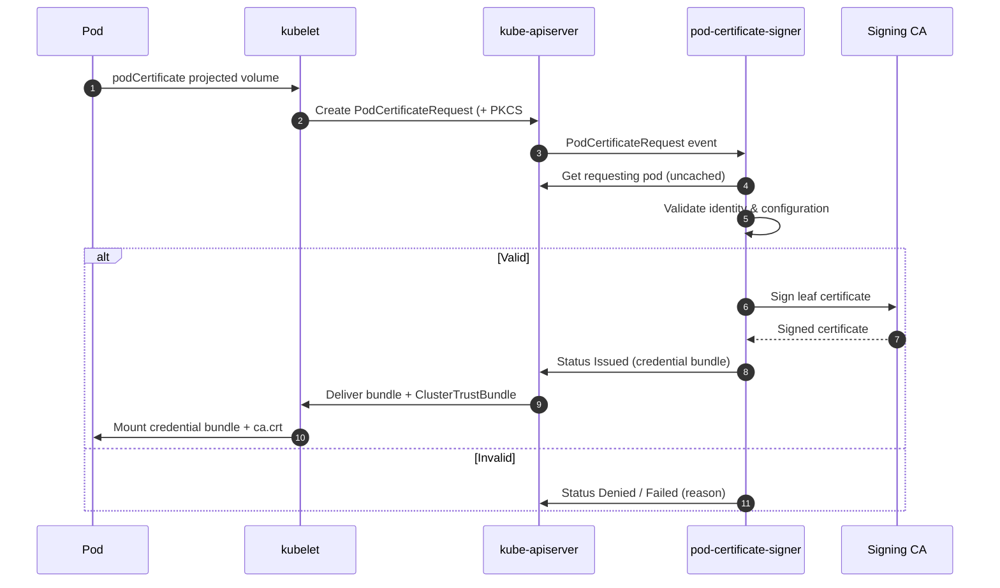
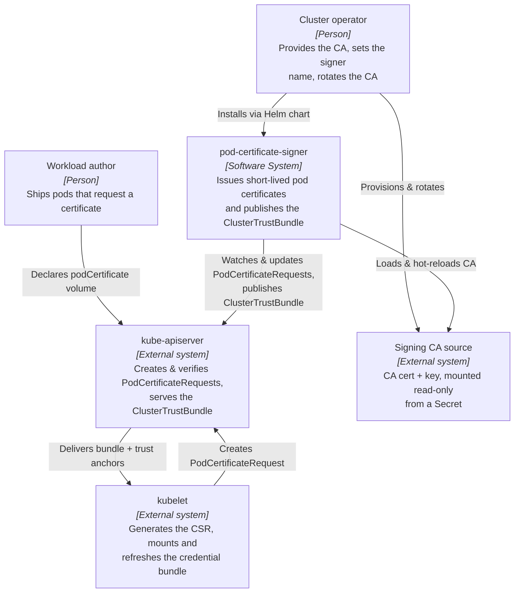
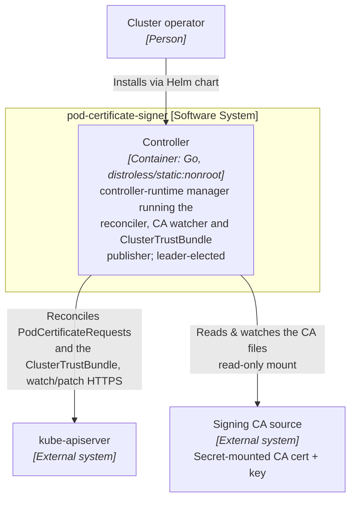
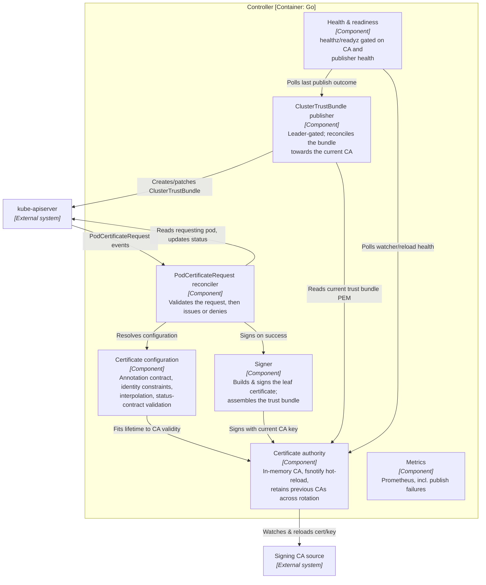

# Architecture

`pod-certificate-signer` is a Kubernetes controller for the built-in
[`PodCertificateRequest`](https://kubernetes.io/docs/reference/access-authn-authz/certificate-signing-requests/#pod-certificate-requests)
API (`certificates.k8s.io/v1`). When a pod declares a `podCertificate`
projected volume that names this signer, the kube-apiserver creates a
`PodCertificateRequest`; the controller validates it and either issues a
short-lived x509 certificate from your CA or denies the request. In parallel it
publishes the signer's CA — current and previously used, across rotations — as a
[`ClusterTrustBundle`](https://kubernetes.io/docs/reference/access-authn-authz/certificate-signing-requests/#cluster-trust-bundles)
so workloads can mount the matching trust anchors next to their certificates.

It is **not** a CSR (`CertificateSigningRequest`) signer and **not** an
authentication proxy: the only requests it acts on are `PodCertificateRequest`
objects that the apiserver itself creates and whose identity fields it has
already verified.

## Request flow

1. A pod is created with a `podCertificate` projected volume that names this
   signer. Kubelet generates the key pair and a PKCS#10 CSR, and the
   kube-apiserver creates a `PodCertificateRequest` carrying the pod's
   apiserver-verified identity fields.
2. The controller's reconciler picks up the request for its signer name and
   reads the requesting pod directly (an uncached `get`, never a cached
   list/watch).
3. It resolves the certificate configuration from the request's
   `unverifiedUserAnnotations` (falling back to deprecated pod annotations),
   enforces the identity constraints, and validates the result against the same
   limits the apiserver applies to the request status.
4. On success the signer builds and signs the leaf certificate from the current
   CA and writes the credential bundle to the request status (`Issued`).
   Otherwise the request is `Denied` or `Failed` with a reason.
5. Kubelet delivers the issued credential bundle to the pod and keeps it fresh,
   mounting the signer's `ClusterTrustBundle` alongside it for peer
   verification.

## C4 model

The following [C4 model](https://c4model.com/) views zoom in from the signer in
its cluster environment down to the components inside the controller. They are
generated from [`c4/workspace.dsl`](./c4/workspace.dsl) (Structurizr DSL) — edit
the model there and keep the diagrams below in step. The Mermaid blocks render
natively on GitHub.

### System context (C4 level 1)

Who the signer serves and what it depends on: a cluster operator provides the
CA and configures the signer, workloads request certificates through the
apiserver, and the signer watches `PodCertificateRequest`s and publishes the
`ClusterTrustBundle`.

### Containers (C4 level 2)

The signer ships as a single deployable — one leader-elected controller
Deployment — and integrates with the apiserver and the mounted CA.

### Components (C4 level 3)

Inside the controller, three concerns run in one process: reconciling requests,
tracking the CA on disk, and publishing the trust bundle.

## Component overview

| Component | Responsibility | Leader-gated |
| --- | --- | --- |
| **PodCertificateRequest reconciler** | Watches `PodCertificateRequest`s for the configured signer name, reads the requesting pod (uncached `get`), drives validation and records the `Issued`/`Denied`/`Failed` outcome. | No — runs on every replica |
| **Certificate configuration** | Parses the annotation contract, enforces identity constraints, resolves `${...}` interpolation, and validates duration/refresh/EKU against the apiserver status contract. | No |
| **Certificate authority** | Holds the in-memory CA, hot-reloads the cert/key when the mounted files change (fsnotify), and retains up to `--max-previous-ca-certs` previous CAs across rotation. | No — every replica keeps its CA current |
| **Signer** | Builds and signs the leaf certificate from the CSR and resolved configuration; assembles the trust bundle PEM. | No |
| **ClusterTrustBundle publisher** | Reconciles the signer's `ClusterTrustBundle` towards the current CA on reload events and a 10-minute drift-repair tick, with single-flight retries. | **Yes** — only the elected leader writes the shared resource |
| **Health & readiness** | Serves `healthz`/`readyz`; readiness is gated on CA watcher/reload health and the publisher's last outcome. | No |
| **Metrics** | Exposes Prometheus metrics under the `podcertificatesigner_` prefix, alongside controller-runtime's. The surface is bounded by [ADR-0005](adr/0005-bounded-metrics-surface.md): no label carries a pod, request or certificate identity. | No |

The CA watcher runs on **every** replica so a standby never signs or publishes
with stale material immediately after being promoted; only the publisher is
leader-gated, so exactly one replica writes the shared `ClusterTrustBundle`. See
[Operations](./operations.md) for how these behave during CA rotation, leader
changes and restarts.

## Security posture

- **Distroless, non-root image.** The controller runs on
  `gcr.io/distroless/static:nonroot` — no shell, no libc, no package manager —
  as a non-root user (UID `65532`). There is nothing in the image to exec into
  and almost no OS surface for a CVE to land on.
- **Static, CGO-disabled binary.** The manager is built with `CGO_ENABLED=0` as
  a fully static binary, so the image needs no dynamic libraries and the
  attack surface is the Go binary alone.
- **Restricted pod security by default.** The chart's defaults comply with the
  `restricted` Pod Security Standard: `runAsNonRoot`, `seccompProfile:
  RuntimeDefault`, `readOnlyRootFilesystem`, `allowPrivilegeEscalation: false`
  and `capabilities: drop: [ALL]`.
- **Least-privilege RBAC.** The controller reads pods with `get` only (uncached,
  no cluster-wide pod informer) and touches only the `PodCertificateRequest` and
  `ClusterTrustBundle` APIs it needs. Because `pods` is `get`-only, the chart and
  image must roll out together — see [Operations: upgrades](./operations.md#upgrades).
- **Default-secure identity model.** By default the signer issues certificates
  only for the requesting pod's apiserver-verified identity, and the default
  extended key usage is `serverAuth` only. See
  [Configuration: identity constraints](./configuration.md#identity-constraints).
- **CA private key handling.** The signing key is mounted read-only from a
  Secret, held in memory, and hot-reloaded on rotation without a restart. See
  [SECURITY.md](../SECURITY.md) for the full threat model and reporting policy.
